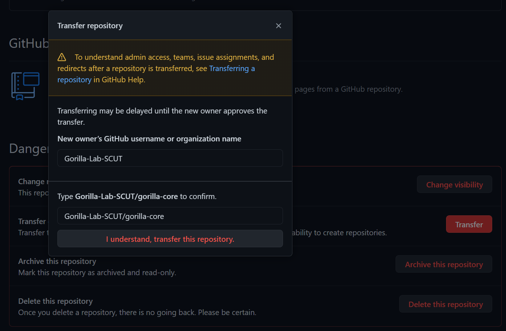

# 仓库迁移
该手册目的旨在让同学们学会将自己的项目仓库转让给实验室的组织账号名下。
该教程参考了GitHub[官方教程](https://docs.github.com/cn/github/administering-a-repository/transferring-a-repository)，同学们可以前往该网页查看细节。

首先进入项目仓库，点击 `settings` 进入仓库设置：

然后拉到最下方，在 `Danger Zone（危险区域）` 下，单击 `Transfer（转让）`：

单击后，跳出弹窗，填入以下信息：
- organization name: **Jia-Gorilla-Lab**
- type confirm: **your repository name**

输入后点击 `I understand, transfer this repository` 即可实现仓库转移。

仓库转移后可以看到仓库的拥有者发生了改变：

但相关的内容 （`Pull Request, issue, commit`）并没有发生改变，仓库的拥有者依旧是您，以上便实现了仓库的转移。
